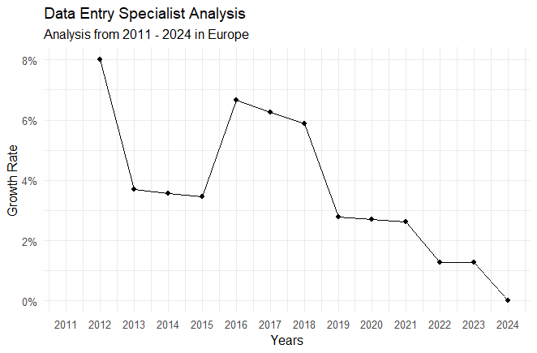

# IT Jobs Analysis 2011 - 2024

A project with estimated numbers to analyze IT jobs from 2011 to 2024.

Following job roles I included in my project:

-   Data Analyst

-   Front-End Developer

-   Back-End Developer

-   Data Entry Specialist

-   Network Engineer

-   Security Analyst

-   Database Administrator

-   AI/ML Researcher

**Note**: The estimated numbers in data set may not be a perfect numbers because I created this data set with the help of *Chatgpt* so there might be mistakes in numbers but that's a good project to consider as a beginner level.

## Trend Analysis

In Trend Analysis, You need to research about two things.

-   Each Job Role Analysis

-   Region Wise Analysis

### Each Job Role Analysis

In each job role analysis, you need to analyze the changes in specific job according to years like which one increases and decreases.

``` r
# creating new dataframe to get data for each job role according to years
# It will sum up the data for each job role each year
job_df <- df %>%
group_by(Year,`Job Type`) %>%
  summarise(Total=sum(`Estimated Number`))

# Now filtering data for only data analyst , you can set your own specific interest of role.
year_data_DataAnalyst <- job_df %>%
  filter(`Job Type`=="Data Analyst")
```

Now we have data for "data analyst" , let's create a Scatter plot with more clear representation of our result.

``` r
# creating scatter plot with Year on x-axis and Total on y-axis
ggplot(data=year_data_DataAnalyst,aes(x=Year,y=Total)) +
  geom_line()+ geom_point() +
  # Adding breaks from 2011 to 2024 to include each year in plot
  scale_x_continuous(breaks=seq(2011, 2024, by=1)) +
  # Setting theme of choice , you can pick your own 
  theme_minimal()+
  labs(title="Data Analyst Analysis",subtitle="Analysis from 2011 - 2024",x="Years",y="Estimated Numbers")
```

{width="594"}

Just like that you can perform for other job roles to analyze the increase or decrease of estimated numbers of jobs.

### Region-wise Analysis

Now analyze specific job role in each year region wise according to their growth rates that how patterns changed or in which region there is an increase or decrease.

For Example:

``` r
# Calculating growth rate for each job region wise 
growth_rate_data <- df %>%
  group_by(Region,`Job Type`) %>%
  # used dplyr's lag function to shift a time series or vector by a specified number of periods, often to create lagged variables for time series analysis or data manipulation 
  mutate(Growth_Rate = (`Estimated Number`-lag(`Estimated Number`))/lag(`Estimated Number`))
```

Now, we have created our new column of Growth Rate, let's create a new dataframe object in which we filter by region and job type.

``` r
regions_wise <- growth_rate_data %>%
  filter(Region=="Europe",`Job Type`=="Data Entry Specialist")
```

Let's create a scatter plot for better representation.

``` r
ggplot(data=regions_wise,aes(x=Year,y=Growth_Rate)) +
  geom_line()+ geom_point() +
  scale_x_continuous(breaks=seq(2011, 2024, by=1)) +
  theme_minimal() + 
  labs(title="Data Entry Specialist Analysis",subtitle="Analysis from 2011 - 2024 in Europe",x="Years",y="Growth Rate") +
    scale_y_continuous(labels=scales::percent)
```

{width="594"}

## Regional Distribution

Now, we need to do regional analysis that which region had the highest number of jobs.

Let's go for latest year in our dataset for analysis.

``` r
# Sum up the data for each job role on latest year filtered
regional <- growth_rate_data %>%
  filter(Year==max(Year)) %>%
  group_by(Region) %>%
  summarise(Total=sum(`Estimated Number`))
```

Now we got the total number of jobs region wise in 2024.

Let's create a plot for more clear representation.

``` r
# Initializes the plot with the dataset regional, setting the x-axis to regions ordered by descending total jobs and the y-axis to the total estimated jobs.
ggplot(data=regional,aes(x=reorder(Region, -Total),y=Total))+
  geom_bar(stat="identity",aes(fill=Region))+
  # Flips the x and y axes, displaying horizontal bars instead of vertical ones.
  coord_flip() +
  theme_minimal() +
  #Removes the x-axis text labels.
  theme(axis.text.x = element_blank()) +
  labs(x="Regions",y="Total Estimated Jobs",title="Job Analysis 2024",subtitle="Analysis on total number of estimated jobs in each region 2024")
```

{width="594"}

## Role Popularity

Now we will calculate which job role has great popularity from 2011-2024.

``` r
role_popular <- df %>%
  group_by(`Job Type`) %>%
  summarise(Total=sum(`Estimated Number`))
```

Now creating bar chart for more clear representation of our result.

``` r
ggplot(data=role_popular,aes(x=reorder(`Job Type`, -Total),y=Total)) +
  geom_bar(stat="identity",aes(fill=`Job Type`)) +
  theme_minimal() + 
  theme(axis.text.x = element_blank()) +
  theme(axis.text.y = element_blank()) +
  coord_flip() +
  labs(x="Job Roles",y="Total Estimated Jobs",title="IT Jobs Analysis",subtitle="Analysis on total number of estimated jobs for each role.")
```

{width="594"}

## Yearly Comparison

Now we will do a yearly comparison that which year there are more and more IT jobs.

I know the answer is 2024 but lets visualize it for fun!

``` r
yearly_Comparison <- growth_rate_data %>%
  group_by(Year) %>%
  summarise(Total=sum(`Estimated Number`))
```

Now we have data for total number of IT jobs year wise. Let's visualize it for clear representation.

``` r
ggplot(data=yearly_Comparison,aes(x=reorder(Year,Total),y=Total)) +
  geom_bar(stat="identity",fill="lightgreen") +
  theme_minimal() + 
  theme(axis.text.x = element_blank()) +
  coord_flip() +
  labs(x="Years", y="Total IT Jobs",title="IT Jobs Analysis",subtitle="Year wise analysis 2011-2024")
```

{width="594"}

So, That's a beginner level project to practice on and let me make sure again that data set might not contain a real estimated amount but its good for practice.
